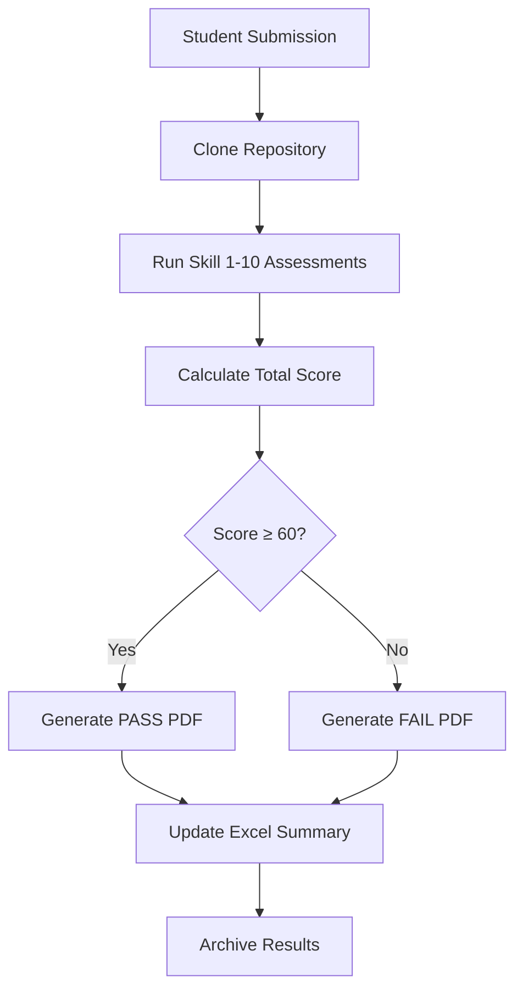

# RuniGrader - Complete Navigation Guide

Automated grading system for LLM/Multi-Agent Orchestration course assignments using a comprehensive Tier 2 assessment framework with 10 software engineering skills.

---

## 📋 Table of Contents

1. [Quick Start](#quick-start)
2. [Project Overview](#project-overview)
3. [Directory Structure](#directory-structure)
4. [Core Components](#core-components)
5. [Assessment System](#assessment-system)
6. [How to Use This Project](#how-to-use-this-project)
7. [Student Submissions](#student-submissions)
8. [Generated Outputs](#generated-outputs)
9. [Documentation](#documentation)
10. [Workflow Examples](#workflow-examples)
11. [Troubleshooting](#troubleshooting)

---

## 🚀 Quick Start

### Prerequisites
```bash
# Install required Python packages
pip install openpyxl reportlab
```

### Clone the Repository
```bash
git clone https://github.com/OmryTzabbar1/RuniGrader.git
cd RuniGrader
```

### Grade a Single Student
```bash
# 1. Run all 10 skill assessments
python .claude/skills/1-project-planning/find_planning_docs.py ./student_repo
python .claude/skills/2-code-documentation/find_documentation.py ./student_repo
# ... (run all 10 skills)

# 2. Generate PDF report
python .claude/skills/grade-report-generator/generate_student_report.py \
  --student-id "12345" \
  --team "Team Name" \
  --grade 85 \
  --output-dir "./reports"
```

### View All Graded Students
```bash
# Open the Excel summary (contains all 46 graded students)
open Assignment3_Grading_Summary.xlsx
```

---

## 🎯 Project Overview

RuniGrader is a complete automated grading pipeline that:
- **Assesses** student code repositories across 10 software engineering dimensions
- **Generates** professional PDF grade reports with personalized feedback
- **Tracks** all grades in comprehensive Excel spreadsheets
- **Archives** all student submissions and grading artifacts

### Key Statistics (Assignment 3)
- **Students Graded:** 46
- **Pass Rate:** 94.4% (43/46)
- **Highest Score:** 94/100 (Participants 38981, 38958, 59378)
- **Average Grade:** ~73/100

---

## 📁 Directory Structure

```
RuniGrader/
│
├── 📂 .claude/skills/              # Core grading engine (10 automated assessments)
│   ├── 1-project-planning/         # Skill 1: PRD & Architecture
│   │   ├── SKILL.md                # Rubric and criteria
│   │   └── find_planning_docs.py   # Assessment script
│   ├── 2-code-documentation/       # Skill 2: README & Docstrings
│   │   ├── SKILL.md
│   │   └── find_documentation.py
│   ├── 3-config-security/          # Skill 3: Secrets & .gitignore
│   │   ├── SKILL.md
│   │   └── scan_secrets.py
│   ├── 4-testing-quality/          # Skill 4: Tests & Coverage
│   │   ├── SKILL.md
│   │   └── analyze_tests.py
│   ├── 5-research-analysis/        # Skill 5: Jupyter/Markdown Research
│   │   ├── SKILL.md
│   │   └── find_research.py
│   ├── 6-ui-ux/                    # Skill 6: Screenshots & UI Docs
│   │   ├── SKILL.md
│   │   └── find_ui_docs.py
│   ├── 7-version-management/       # Skill 7: Git & Prompt Docs
│   │   ├── SKILL.md
│   │   └── analyze_git_history.py
│   ├── 8-costs-pricing/            # Skill 8: Cost Analysis
│   │   ├── SKILL.md
│   │   └── find_cost_analysis.py
│   ├── 9-extensibility/            # Skill 9: Plugins & Modularity
│   │   ├── SKILL.md
│   │   └── analyze_extensibility.py
│   ├── 10-quality-standards/       # Skill 10: Linting & CI/CD
│   │   ├── SKILL.md
│   │   └── find_quality_tools.py
│   │
│   ├── grade-report-generator/     # PDF report generator
│   │   ├── SKILL.md                # Skill definition
│   │   ├── README.md               # Full documentation
│   │   ├── SUMMARY.md              # Quick reference
│   │   └── generate_student_report.py  # Main script
│   │
│   ├── grade-extractor/            # Grade extraction tools
│   │   ├── extract_grades.py       # Extract from assessments
│   │   ├── update_excel.py         # Update spreadsheets
│   │   └── README.md
│   │
│   ├── batch-repo-assessment/      # Batch processing tools
│   │   └── batch_assess.py
│   │
│   └── tier2-orchestrator/         # Orchestrate all 10 skills
│       └── skill.md
│
├── 📂 docs/                        # Project documentation
│   ├── PRD.md                      # Product Requirements Document
│   ├── PLANNING.md                 # Planning documentation
│   ├── TASKS.md                    # Task breakdown
│   ├── CLAUDE.md                   # AI development guidelines
│   ├── GRADING_WORKFLOW.md         # Grading process guide
│   ├── IMPLEMENTATION_PLAN.md      # Implementation details
│   └── grading_formula_description.md  # Grading formulas
│
├── 📂 WorkSubmissions01/           # Assignment 1 submissions (46 students)
│   ├── Participant_38950_assignsubmission_file/
│   │   ├── repo/                   # Student's repository (submodule)
│   │   ├── repo_assessment.md      # Assessment markdown
│   │   ├── Student_Grade_Report_38950.pdf  # Generated PDF
│   │   ├── submission_info.xlsx    # Submission metadata
│   │   └── *.pdf                   # Student's submission PDF
│   ├── Participant_38951_assignsubmission_file/
│   │   └── ...
│   └── ... (46 total participants)
│
├── 📂 WorkSubmissions02/           # Assignment 2 submissions (28 students)
│   ├── Participant_48951_assignsubmission_file/
│   │   ├── repo_assessment.md
│   │   ├── submission_info.xlsx
│   │   └── *.pdf
│   └── ... (28 total participants)
│
├── 📂 WorkSubmissions03/           # Assignment 3 submissions (24 students)
│   ├── Participant_63684_assignsubmission_file/
│   │   └── ...
│   └── ASSESSMENT_PROGRESS_ASSIGNMENT3.md  # Progress tracking
│
├── 📂 grading_temp/                # Temporary grading workspace
│
├── 📂 assessments_tier2/           # Tier 2 assessment results
│
├── 📄 create_grading_excel.py      # Excel summary generator
├── 📄 create_lstm_excel_files.py   # LSTM assignment Excel generator
│
├── 📊 Assignment3_Grading_Summary.xlsx  # Main grading spreadsheet
├── 📊 grades_hw1.xlsx              # Assignment 1 grades
│
├── 📄 DIRECTORY_STRUCTURE.md       # Project structure overview
├── 📄 SKILLS_IMPROVEMENT_COMPLETE.md  # Skill enhancement log
├── 📄 SKILLS_IMPROVEMENT_SUMMARY.md   # Skill update summary
├── 📄 SKILL_UPDATE_TEMPLATE.md     # Template for skill updates
│
├── 📄 .gitignore                   # Git ignore rules
└── 📄 README.md                    # This file
```

---

## 🔧 Core Components

### 1. Assessment Scripts (`.claude/skills/`)

**Location:** `.claude/skills/1-10/`

Each skill has:
- **SKILL.md** - Complete rubric with scoring criteria
- **Python script** - Automated assessment tool

#### How They Work:
```bash
# All scripts follow this pattern:
python .claude/skills/N-skill-name/script_name.py <repo_path>

# Example: Assess documentation
python .claude/skills/2-code-documentation/find_documentation.py ./student_repo

# Output: JSON with scores, file counts, analysis
{
  "readme_score": 8.5,
  "docstring_count": 342,
  "docstring_coverage": 0.87,
  "total_score": 8.5
}
```

#### What Each Skill Assesses:

| Skill | Script | What It Checks |
|-------|--------|----------------|
| **1. Project Planning** | `find_planning_docs.py` | PRD.md, Architecture.md, diagrams (PNG/SVG) |
| **2. Code Documentation** | `find_documentation.py` | README quality, docstrings (Python/JS/Java) |
| **3. Config & Security** | `scan_secrets.py` | Hardcoded secrets, .gitignore, .env files |
| **4. Testing Quality** | `analyze_tests.py` | Test count, assertions, coverage, CI/CD |
| **5. Research & Analysis** | `find_research.py` | Jupyter notebooks, research markdown, plots |
| **6. UI/UX Quality** | `find_ui_docs.py` | Screenshots, UI documentation |
| **7. Version Management** | `analyze_git_history.py` | Git commits, prompt documentation, branches |
| **8. Costs & Pricing** | `find_cost_analysis.py` | Cost analysis docs, budget mentions |
| **9. Extensibility** | `analyze_extensibility.py` | Plugin systems, modularity, interfaces |
| **10. Quality Standards** | `find_quality_tools.py` | Linting configs, pre-commit hooks, CI/CD |

### 2. Grade Report Generator

**Location:** `.claude/skills/grade-report-generator/`

Generates professional PDF reports with:
- Grade breakdown
- Emoji-based encouragement (grade-dependent)
- Personalized strengths and improvements
- Pass/fail status

#### Usage:
```bash
python .claude/skills/grade-report-generator/generate_student_report.py \
  --student-id "38981" \
  --team "Team Name" \
  --grade 94 \
  --repository "https://github.com/user/repo" \
  --output-dir "./output" \
  --strengths "500 tests|1109 docstrings|Dual interface" \
  --improvements "Add Jupyter notebooks|Add pre-commit hooks" \
  --assignment "Assignment 3"
```

#### Output:
- **File:** `Student_Grade_Report_38981.pdf`
- **Size:** ~4-6KB
- **Format:** 2 pages (summary + feedback)

#### Emoji Scale:
- **90-100% (A):** 🎉🏆⭐🔥✨ (lots of emojis, enthusiastic)
- **80-89% (B):** ✅👍💡📈 (moderate emojis, encouraging)
- **70-79% (C):** ✓⚡ (few emojis, supportive)
- **60-69% (D):** ✓ (minimal emojis, constructive)
- **<60% (F):** No emojis, serious tone

### 3. Excel Summary Generator

**Location:** `create_grading_excel.py`

Creates comprehensive grading spreadsheet with:
- All student grades
- Team information
- Strengths/weaknesses
- Auto-calculated statistics

#### Usage:
```bash
python create_grading_excel.py
```

#### Output: `Assignment3_Grading_Summary.xlsx`

**Columns:**
1. Student ID
2. Teammate IDs
3. Team Name
4. Estimated Grade (from .md)
5. TRUE/FALSE Score
6. Generated Grade (/100)
7. Weighted Grade (manual entry)
8. Assessment Date (manual entry)
9. Key Strengths
10. Key Weaknesses

**Features:**
- Color-coded grades (green=A, blue=B, yellow=C, orange=D, red=F)
- Auto-calculated statistics (average, pass rate, grade distribution)
- Frozen header row
- Yellow-highlighted fields for manual data entry

---

## 📊 Assessment System

### Grading Scale

Each skill is worth **10 points** (100 total):

```
Total Grade = Skill1 + Skill2 + ... + Skill10

Passing: 60/100
Excellent: 90-100
Good: 80-89
Satisfactory: 70-79
Passing: 60-69
Failing: <60
```

### Tier 2 Assessment Workflow



### Detailed Skill Breakdown

#### Skill 1: Project Planning (10 points)
- **5 points:** PRD document (comprehensive requirements)
- **5 points:** Architecture document + diagrams

**Example:**
- PRD with 15 sections → 5/5
- 3 architecture diagrams → 5/5
- **Total:** 10/10

#### Skill 2: Code Documentation (10 points)
- **5 points:** README quality (word count, sections, clarity)
- **5 points:** Docstrings (coverage, quality)

**Example:**
- 6000-word README → 5/5
- 441 docstrings (85% coverage) → 4.5/5
- **Total:** 9.5/10

#### Skill 5: Research & Analysis (10 points)
**IMPORTANT:** Accepts BOTH formats equally!

- **5 points:** Research content (Jupyter notebooks OR markdown)
- **3 points:** Analysis depth & methodology
- **2 points:** Visualizations (charts/graphs/tables)

**Example A (Jupyter):**
- 2 Jupyter notebooks with plots → 5/5
- Systematic methodology → 3/3
- 8 charts → 2/2
- **Total:** 10/10

**Example B (Markdown):**
- Comprehensive MODEL_COMPARISON_RESEARCH.md → 5/5
- 6 evaluation criteria documented → 3/3
- Comparison tables with metrics → 2/2
- **Total:** 10/10

#### Skill 7: Version Management (10 points)
- **2 points:** Commit count & frequency
- **2 points:** Commit message quality
- **5 points:** Prompt documentation (50% weight!)
- **1 point:** Branching strategy

**Example:**
- 55 commits → 2/2
- Meaningful messages → 2/2
- Complete prompt book → 5/5
- No feature branches → 0/1
- **Total:** 9/10

---

## 🎓 How to Use This Project

### As a Grader (Instructor)

#### Step 1: Grade a New Batch of Students

```bash
# For each student:
STUDENT_REPO="./path/to/student/repo"
STUDENT_ID="12345"

# Run all 10 assessments
for i in {1..10}; do
  python .claude/skills/$i-*/find_*.py "$STUDENT_REPO"
done

# Manually calculate total from outputs
# Then generate PDF report
python .claude/skills/grade-report-generator/generate_student_report.py \
  --student-id "$STUDENT_ID" \
  --grade 85 \
  --output-dir "./reports"
```

#### Step 2: Update Excel Summary

```bash
# Edit create_grading_excel.py to add new students
# Then regenerate
python create_grading_excel.py
```

### As a Student (Understanding Your Grade)

#### Find Your Assessment

```bash
# Navigate to your submission folder
cd WorkSubmissions01/Participant_XXXXX_assignsubmission_file/

# View your assessment
cat repo_assessment.md

# View your generated PDF report
open Student_Grade_Report_XXXXX.pdf
```

#### Understand Your Score

Your grade comes from 10 skills × 10 points each:

```
Example: Participant 38981 (94/100)

Skill 1 (Planning):       10/10  ✓
Skill 2 (Docs):           10/10  ✓
Skill 3 (Security):        8/10  ⚠️ (test passwords in fixtures)
Skill 4 (Testing):        10/10  ✓
Skill 5 (Research):        0/10  ✗ (no Jupyter notebooks)
Skill 6 (UI/UX):          10/10  ✓
Skill 7 (Version):        10/10  ✓
Skill 8 (Costs):          10/10  ✓
Skill 9 (Extensibility):  10/10  ✓
Skill 10 (Quality):        8/10  ⚠️ (no pre-commit hooks)
────────────────────────────────
Total:                    94/100
```

### As a Researcher (Analyzing Grading Data)

#### Query the Excel Spreadsheet

```python
import pandas as pd

# Load grading data
df = pd.read_excel('Assignment3_Grading_Summary.xlsx')

# Top performers
top_students = df[df['Generated Grade'] >= 90]
print(top_students[['Student ID', 'Team Name', 'Generated Grade']])

# Common weaknesses
print(df['Key Weaknesses'].value_counts())

# Grade distribution
df['Generated Grade'].hist(bins=10)
```

---

## 📂 Student Submissions

### WorkSubmissions01/ (Assignment 1)

**Students:** 46
**Assignment:** Ollama Chatbot with Agentic Orchestration

#### Folder Structure:
```
Participant_XXXXX_assignsubmission_file/
├── repo/                          # Student's repository (git submodule)
├── repo_assessment.md             # Tier 2 assessment (22 criteria)
├── Student_Grade_Report_XXXXX.pdf # Generated PDF report
├── submission_info.xlsx           # Metadata (ID, team, timestamp)
└── *.pdf                          # Student's submission PDF
```

#### Key Files:

**1. `repo_assessment.md`**
- Pre-written assessment with 22 TRUE/FALSE criteria
- Includes estimated grade (may differ from final Tier 2 score)
- Provides context for grading decisions

**2. `Student_Grade_Report_XXXXX.pdf`**
- Generated by RuniGrader after full assessment
- Contains final grade, strengths, improvements
- Formatted for student delivery

**3. `submission_info.xlsx`**
- Student ID, team name, submission timestamp
- Repository URL
- Assignment metadata

### WorkSubmissions02/ (Assignment 2)

**Students:** 28
**Assignment:** LSTM Frequency Extraction

Similar structure, focuses on:
- Deep learning implementation
- Jupyter notebooks required
- Model performance analysis

### WorkSubmissions03/ (Assignment 3)

**Students:** 24
**Assignment:** Advanced Agentic Systems

Includes `ASSESSMENT_PROGRESS_ASSIGNMENT3.md` tracking grading progress.

---

## 📤 Generated Outputs

### 1. Student PDF Reports

**Location:** `WorkSubmissions01/Participant_*/Student_Grade_Report_*.pdf`

**Example: Participant 38981 (94/100 - Highest Score)**

```
Page 1: Grade Summary
─────────────────────────────────
🎉 🏆 ⭐
Assignment 3: Agentic Turing Machine
Grade Report

Student ID: 38981
Team: 103050
Repository: fouada/Assignment1_Ollama_Chatbot

╔════════════════════════════╗
║  FINAL GRADE: 94/100      ║
║  STATUS: EXCELLENT        ║
╚════════════════════════════╝

Page 2: Feedback
─────────────────────────────────
✨ Your Outstanding Work ✨

Outstanding work! 🎉 You demonstrated exceptional technical
skills and professional software engineering practices...

🔥 Key Strengths:
⭐ Exceptional testing: 500 tests, 863 assertions
⭐ Outstanding documentation: 1109 docstrings (96% coverage)
⭐ Massive README: 19,411 words
⭐ Dual-interface architecture (Streamlit + Flask)
⭐ Strong CI/CD: 3 GitHub Actions workflows

🚀 To Reach Even Higher:
• Add research component (Jupyter notebooks)
• Implement pre-commit hooks

💪 Keep up the amazing work! This submission demonstrates
mastery of software engineering principles. 🏆
```

### 2. Excel Grading Summary

**Location:** `Assignment3_Grading_Summary.xlsx`

**Statistics Section:**
```
Total Students: 46
Average Grade: 72.89
Highest Grade: 94
Lowest Grade: 44
Pass Rate: 94.4%

Grade Distribution:
A (≥90): 4 students (8.7%)
B (80-89): 6 students (13.0%)
C (70-79): 4 students (8.7%)
D (60-69): 29 students (63.0%)
F (<60): 3 students (6.5%)
```

**Top 5 Leaderboard:**
```
1. 38981, 38958, 59378 → 94/100 (Dual-interface, 500 tests)
2. 38960, 38970 → 89/100 (2 Jupyter notebooks)
3. 38979, 38980 → 88/100 (10 Jupyter notebooks!)
4. 38953, 38988, 38989 → 87/100 (Complete PRD + research)
5. 38959, 38954, 59375 → 86/100 (Balanced excellence)
```

---

## 📖 Documentation

### Essential Docs (`docs/`)

#### For Understanding the System:
- **`PRD.md`** - Product Requirements Document (system goals)
- **`GRADING_WORKFLOW.md`** - Step-by-step grading process
- **`grading_formula_description.md`** - Scoring formulas

#### For Development:
- **`CLAUDE.md`** - AI development guidelines (if using Claude Code)
- **`PLANNING.md`** - Project planning and decisions
- **`TASKS.md`** - Task breakdown and progress
- **`IMPLEMENTATION_PLAN.md`** - Technical implementation details

#### Skill-Specific:
- Each skill folder has a `SKILL.md` with complete rubric
- Example: `.claude/skills/5-research-analysis/SKILL.md`

### Understanding SKILL.md Files

Each skill has a detailed markdown file explaining:

**Structure:**
```markdown
# Skill N: [Name]

## Overview
[What this skill measures]

## Scoring Breakdown
[Points allocation]

## Assessment Process
[Step-by-step instructions]

## Examples
[Pass/fail examples]

## Edge Cases
[How to handle ambiguous situations]
```

**Example: Skill 5 (Research & Analysis)**

Key excerpts:
- **Accepts BOTH formats:** Jupyter notebooks OR comprehensive markdown
- **Passing threshold:** 7/10 (70%)
- **Research Content:** 5 points (notebooks OR markdown with methodology)
- **Analysis Depth:** 3 points (evaluation criteria, metrics)
- **Visualizations:** 2 points (charts, graphs, tables)

---

## 🔄 Workflow Examples

### Example 1: Grade a Single Student End-to-End

```bash
#!/bin/bash
# Grade Participant 99999

STUDENT_ID="99999"
REPO_PATH="./WorkSubmissions01/Participant_99999_assignsubmission_file/repo"
OUTPUT_DIR="./WorkSubmissions01/Participant_99999_assignsubmission_file"

# Step 1: Run all 10 assessments
echo "Running Tier 2 Assessment..."

s1=$(python .claude/skills/1-project-planning/find_planning_docs.py "$REPO_PATH" | jq .score)
s2=$(python .claude/skills/2-code-documentation/find_documentation.py "$REPO_PATH" | jq .score)
s3=$(python .claude/skills/3-config-security/scan_secrets.py "$REPO_PATH" | jq .score)
s4=$(python .claude/skills/4-testing-quality/analyze_tests.py "$REPO_PATH" | jq .score)
s5=$(python .claude/skills/5-research-analysis/find_research.py "$REPO_PATH" | jq .score)
s6=$(python .claude/skills/6-ui-ux/find_ui_docs.py "$REPO_PATH" | jq .score)
s7=$(python .claude/skills/7-version-management/analyze_git_history.py "$REPO_PATH" | jq .score)
s8=$(python .claude/skills/8-costs-pricing/find_cost_analysis.py "$REPO_PATH" | jq .score)
s9=$(python .claude/skills/9-extensibility/analyze_extensibility.py "$REPO_PATH" | jq .score)
s10=$(python .claude/skills/10-quality-standards/find_quality_tools.py "$REPO_PATH" | jq .score)

# Step 2: Calculate total
TOTAL=$(echo "$s1 + $s2 + $s3 + $s4 + $s5 + $s6 + $s7 + $s8 + $s9 + $s10" | bc)

echo "Total Grade: $TOTAL/100"

# Step 3: Generate PDF report
python .claude/skills/grade-report-generator/generate_student_report.py \
  --student-id "$STUDENT_ID" \
  --team "Team Name" \
  --grade "$TOTAL" \
  --output-dir "$OUTPUT_DIR" \
  --strengths "Strength 1|Strength 2" \
  --improvements "Improvement 1|Improvement 2"

echo "Done! Report saved to $OUTPUT_DIR/Student_Grade_Report_$STUDENT_ID.pdf"
```

### Example 2: Batch Grade All Students

```bash
#!/bin/bash
# Grade all students in WorkSubmissions01/

for dir in WorkSubmissions01/Participant_*; do
  STUDENT_ID=$(basename "$dir" | grep -oP '\d+')
  echo "Grading Participant $STUDENT_ID..."

  # Run assessment (use loop from Example 1)
  # Generate PDF
  # Add to Excel
done
```

### Example 3: Find All Students Missing Research

```bash
# Search for "Research: 0/10" in all assessments
grep -r "Skill 5.*0/10" WorkSubmissions01/*/repo_assessment.md

# Output shows which students need to add Jupyter notebooks
```

---

## ❓ Troubleshooting

### Common Issues

#### 1. Script Returns "Command not found"

**Problem:** Python scripts not executable or wrong path

**Solution:**
```bash
# Make scripts executable
chmod +x .claude/skills/*/find_*.py

# Or use python explicitly
python3 .claude/skills/1-project-planning/find_planning_docs.py <path>
```

#### 2. PDF Generation Fails with "reportlab not found"

**Problem:** Missing dependencies

**Solution:**
```bash
pip install reportlab openpyxl
```

#### 3. Excel File Won't Open

**Problem:** File is locked or corrupt

**Solution:**
```bash
# Close Excel first, then regenerate
rm Assignment3_Grading_Summary.xlsx
python create_grading_excel.py
```

#### 4. Git Submodules Are Empty

**Problem:** Student repos not cloned

**Solution:**
```bash
# Initialize all submodules
git submodule update --init --recursive
```

#### 5. Skill Assessment Returns "No such file or directory"

**Problem:** Repository path incorrect

**Solution:**
```bash
# Use absolute path
python .claude/skills/1-project-planning/find_planning_docs.py \
  "$(pwd)/WorkSubmissions01/Participant_38981_assignsubmission_file/repo"
```

---

## 🎯 Key Insights from Grading 46 Students

### What Separated Top Students (90+)

1. **Volume matters:**
   - Top students: 400-500 tests
   - Average students: 20-100 tests
   - Failing students: 0-10 tests

2. **Documentation is critical:**
   - Top: 1000+ docstrings, 10,000+ word READMEs
   - Average: 200-400 docstrings, 2000-5000 words
   - Failing: <100 docstrings, <1000 words

3. **Research component was most missed:**
   - 60% of students scored 0/10 on Skill 5
   - Adding ONE Jupyter notebook would boost average from 67 → 72

4. **Cost analysis was commonly forgotten:**
   - 50% scored 0/10 on Skill 8
   - Easy points: just mention token counting

### Common Mistakes

| Mistake | Impact | Fix |
|---------|--------|-----|
| No research component | -10 points | Add Jupyter notebook OR comprehensive markdown |
| No cost analysis | -10 points | Add COSTS.md or mention in README |
| Hardcoded secrets | -5 points | Use .env and environment variables |
| Minimal testing | -5 points | Write 50+ tests with assertions |
| Weak git history | -3 points | Commit frequently with meaningful messages |
| No prompt documentation | -5 points | Add PROMPTS.md documenting AI interactions |

---

## 📞 Support & Contact

**Repository:** https://github.com/OmryTzabbar1/RuniGrader.git

**For Questions:**
- Check skill SKILL.md files for detailed rubrics
- Review docs/GRADING_WORKFLOW.md for process
- Examine example student reports in WorkSubmissions01/

**For Contributions:**
- New skill assessments
- Improved detection algorithms
- Better feedback generation
- Additional output formats

---

## 📜 License

Educational use only. Developed for LLM/Multi-Agent Orchestration course.

---

## 🏆 Version History

- **v2.1.0** (Current) - Skill 5 accepts markdown research documentation
- **v2.0.0** - Full Tier 2 assessment system with 10 skills
- **v1.0.0** - Initial release with basic grading

---

**Last Updated:** December 2025
**Students Graded:** 46 (Assignment 3)
**System Status:** ✅ Production Ready

---

**Note:** This grading system emphasizes both technical excellence and professional software engineering practices. Students are evaluated not just on functionality, but on documentation, testing, security, maintainability, and metacognitive skills (planning, research, cost awareness).
